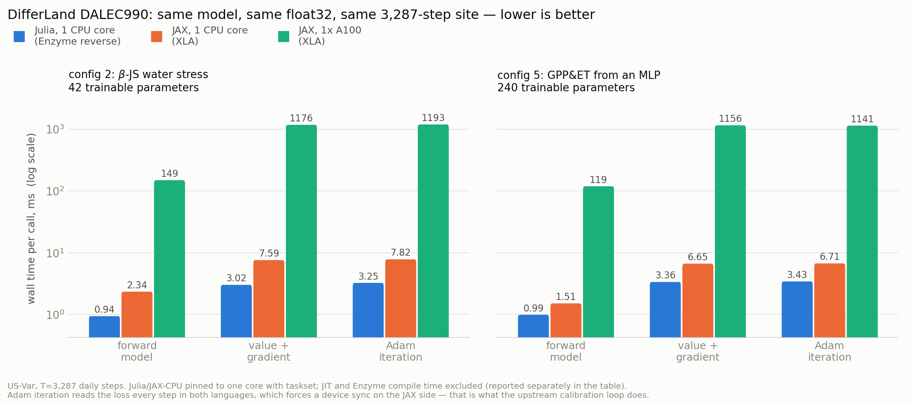
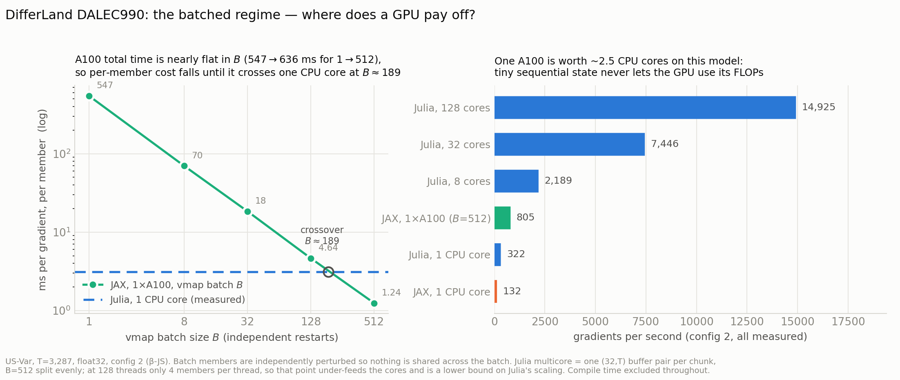

# DifferLand DALEC990 — Julia vs JAX

Measured 2026-08-23 on `curry`: 2× AMD EPYC 7H12 (256 logical cores, znver2),
2× NVIDIA A100-PCIE-40GB, RHEL 8.10. Julia 1.12.6 + Enzyme (reverse mode);
jax 0.4.23 + optax 0.1.9 (the versions the DifferLand conda env pins).
**float32 in both**, matching upstream, which never enables x64.

Workload for every row: site **US-Var**, `T = 3,287` daily steps, 1,826-step
training window, starting from the best-of-40 shipped calibrated parameters.
Two configurations: **config 2** (`default`, β-JS water stress — pure physics,
42 trainable params) and **config 5** (`nn_whole`, GPP and ET both from a
6→10→10→2 MLP — 240 trainable params).

## Fairness rules applied

- Same model, **verified** — see [Correctness](#correctness-first). A speed
  number is meaningless without this.
- Julia and JAX-CPU both hard-pinned to **one core** with `taskset`. Extra cores
  were *measured* and rejected as a variable rather than assumed (§4).
- Every number is min-of-N over a fixed wall-clock budget, after warmup.
- All JAX timings `block_until_ready()`.
- **Compile time is excluded from steady state and reported separately** (§3).
  It is real, and it is the one place Julia loses badly.
- The end-to-end loop reads the loss every iteration in *both* languages,
  because that is what upstream `calibration.py` does (it tests for NaN). The
  no-sync JAX variant is reported too; it makes no difference.
- GPU 1 only; GPU 0 was occupied by an unrelated job for the whole session.

## Correctness first

Float32 agreement alone would be a weak claim — the model is float32-chaotic
over 3,287 sequential steps — so the gate is *relative*, against a float64
rerun of the **upstream JAX code** (`bench/f64_reference.py`):

| | jl-f32 vs jax-f32 | jl-f32 vs f64 | jax-f32 vs f64 |
| --- | ---: | ---: | ---: |
| loss (config 2) | **7.4e-08** | 7.6e-06 | 7.6e-06 |
| trajectory 32×3287, scaled max | **2.7e-04** | 5.408e-03 | 5.408e-03 |
| gradient, L2 rel (42 params) | **1.3e-04** | 8.98e-04 | 8.58e-04 |
| loss (config 5) | **1.4e-07** | 2.3e-06 | 2.4e-06 |
| trajectory | **1.0e-04** | 5.209e-03 | 5.208e-03 |
| gradient (240 params) | **1.1e-04** | 8.84e-04 | 7.86e-04 |

Julia agrees with JAX **20–50× more tightly than JAX agrees with its own float64
answer**, and Julia's distance from the float64 truth is indistinguishable from
JAX's (5.408e-03 vs 5.408e-03). Gradient cosine vs JAX: 0.9999999918 and
0.9999999958.

End-to-end, 2,000 real Adam iterations from the same start: the loss traces
agree to ~1e-7 for the first 20 iterations and have drifted only ~5e-5 by
iteration 1,500. Same optimization — so the timing comparison is like-for-like.

Three upstream defects are reproduced rather than fixed (`BUGCOMPAT` sites in
`src/`); see [README](README.md#transcription-rules).

## 1. Steady-state, one site (ms per call, lower is better)

| | config 2: Julia 1c | JAX 1c | JAX A100 | config 5: Julia 1c | JAX 1c | JAX A100 |
| --- | ---: | ---: | ---: | ---: | ---: | ---: |
| forward model | **0.94** | 2.34 | 149.3 | **0.99** | 1.51 | 118.9 |
| loss (forward + reductions) | **1.06** | 2.53 | 148.4 | **1.12** | 1.68 | 118.6 |
| value + gradient | **3.02** | 7.59 | 1176 | **3.36** | 6.65 | 1156 |
| full Adam iteration | **3.25** | 7.82 | 1193 | **3.43** | 6.71 | 1141 |
| AD overhead (grad / loss) | 2.83× | 3.00× | 7.93× | 3.00× | 3.97× | 9.74× |

**CPU:** Julia is 2.0–2.5× faster, and the margin is **uniform across forward
and gradient**, which locates the cause: this is scalar sequential-scan code
generation, not the AD strategy. LLVM on a `for` loop over `SVector` state beats
XLA's CPU backend by ~2.5× when the per-step state is 8 floats. Enzyme's AD
overhead is also slightly better than XLA's (2.8–3.0× vs 3.0–4.0× the primal).

Config 5 narrows the forward gap to 1.5× exactly where you would expect —
replacing ACM's transcendental chain with an MLP moves work into matmuls, which
XLA does well. For the same reason JAX's config-5 forward (1.51 ms) is *faster*
than its config-2 forward (2.34 ms).

**One A100, one site: 160–390× slower than one CPU core.** 149 ms / 3,287 steps
= 45 µs per timestep, which is kernel-launch and sync latency, not arithmetic —
the state is 8 floats. The AD overhead also inflates to 8–10× because the
reverse pass roughly doubles the kernel count. A single-site calibration would
take **8.3 hours** on an A100 versus **81 seconds** on one CPU core.

## 2. End-to-end calibration, one site (25,000 Adam iterations)

| | config 2 | config 5 |
| --- | ---: | ---: |
| **Julia, 1 core** | **81 s** | **86 s** |
| JAX, 1 core (as-shipped, syncs each iter) | 195 s | 168 s |
| JAX, 1 core (sync only at the end) | 195 s | 167 s |
| JAX, 1×A100 | 29,817 s (8.3 h) | 28,537 s (7.9 h) |
| Julia speedup vs JAX 1 core | **2.4×** | **2.0×** |

The as-shipped and async JAX numbers are identical, so the per-iteration device
sync costs nothing at 7 ms/iteration — worth checking rather than assuming.

## 3. Cold start — where Julia loses

| | config 2 | config 5 |
| --- | ---: | ---: |
| **Enzyme compile, gradient** | **52.2 s** | **18.1 s** |
| XLA JIT, gradient (CPU) | 4.8 s | 4.1 s |
| XLA JIT, gradient (A100) | 6.0 s | 6.0 s |
| Julia compile, forward / loss | 0.21 / 1.30 s | 0.50 / 0.30 s |
| XLA JIT, forward / loss (CPU) | 0.62 / 1.08 s | 0.54 / 0.95 s |

Enzyme is **~10× slower to compile the reverse pass** than XLA is to JIT it.
Total time-to-answer for a single 25k calibration: Julia 52 + 81 = **133 s**,
JAX-CPU 4.8 + 195 = **200 s**. Julia still wins, but the margin drops from 2.4×
to 1.5×, and for a *single short* run JAX would win.

## 4. Does JAX want more CPU cores? No.

value + gradient, JAX CPU, `taskset` to N cores:

| cores | config 2 | config 5 |
| ---: | ---: | ---: |
| 1 | 7.596 ms | 6.617 ms |
| 8 | 7.609 ms | 6.635 ms |
| 32 | 8.234 ms | 6.678 ms |

Flat, then slightly *worse* at 32 (thread-pool overhead). A 3,287-step
sequential scan has no parallelism over time and the reductions are too small to
matter. This is why the one-core comparison is the fair one, and it is measured
rather than argued.

## 5. The batched regime — JAX's home turf

§1–4 measure one site, which is the wrong test to stop at: JAX's design point is
**batching**. Upstream runs 40 random restarts per (site, config) — the shipped
`calibrated_parameters/` directory holds 16 sites × 6 configs × 40 = **3,840
calibrations** — and those are independent, so `vmap` should put hundreds of
them on one A100 at once. Measured (config 2, value+gradient, members
independently perturbed so nothing is shared across the batch):

| vmap batch B | total ms | ms per member |
| ---: | ---: | ---: |
| 1 | 546.6 | 546.6 |
| 8 | 560.8 | 70.1 |
| 32 | 590.6 | 18.5 |
| 128 | 593.9 | 4.64 |
| 512 | 636.3 | **1.24** |

Total time is nearly **flat** in B (546 → 636 ms for 512× the work): the A100 is
latency-bound, so batching is almost free and per-member cost falls ~linearly.
That is XLA working exactly as designed. Peak memory at B=512: 30.8 GB.

> **A discrepancy worth naming.** The B=1 point above (546.6 ms) is 2.2× faster
> than the unbatched A100 gradient in §1 (1,176 ms). Both are correct
> measurements — of *different programs*. `vmap` introduces a size-1 leading
> axis, which changes the HLO and lets XLA fuse differently even at batch 1. §1
> reports the code path upstream actually runs (`jax.value_and_grad` with no
> vmap); §5 reports the batched program. The 2.2× gap is free performance
> available to upstream today by wrapping in `vmap` even for a single site.

Matched Julia measurement (B=512 gradients, one `(32,T)` buffer pair per chunk):

| | ms per member | gradients/s | vs 1×A100 |
| --- | ---: | ---: | ---: |
| JAX, 1 CPU core | 7.59 | 132 | 0.16× |
| Julia, 1 core | 3.11 | 322 | 0.40× |
| **JAX, 1×A100, B=512** | **1.24** | **805** | **1×** |
| Julia, 8 cores | 0.457 | 2,189 | 2.7× |
| Julia, 32 cores | 0.134 | 7,446 | 9.3× |
| Julia, 128 cores | 0.067 | 14,925 | 18.5× |

**Even on its home turf, one A100 is worth about 2.5 CPU cores for this model.**
The crossover against a single core is at B ≈ 190. The reason is structural, not
a tuning failure: an 8-float state advanced 3,287 times sequentially has no
arithmetic intensity, so the GPU's FLOPs are unreachable and only its ability to
hide launch latency across the batch is doing any work.

Extrapolated to the full published sweep (3,840 calibrations × 25,000
iterations ≈ 96M gradients), from measured throughput only:

| | sweep wall clock |
| --- | ---: |
| JAX, 1 CPU core | ~202 h |
| JAX, 1×A100 (batched restarts) | ~33 h |
| Julia, 128 cores | **~1.8 h** |

The Julia figure is *conservative*: at B=512 across 128 threads each thread gets
only 4 members, so that point under-feeds the cores. A real 3,840-member sweep
would scale better.

## Summary

- **Correctness is not in question.** The Julia port sits inside the model's own
  float32 noise floor, and the two Adam trajectories are the same optimization.
- **Single site, one core: Julia 2.0–2.4× faster** end-to-end, uniformly across
  forward and gradient. It is scalar-scan codegen, not AD.
- **Single site on a GPU is a mistake in either language** — 8.3 h vs 81 s.
- **Batched, one A100 ≈ 2.5 CPU cores.** JAX's batching machinery works as
  designed (total time flat in B), but the model has too little arithmetic per
  sequential step for a GPU to matter. On this node the CPUs win by ~18×.
- **Julia's real cost is cold start:** 52 s of Enzyme compile vs 4.8 s of XLA
  JIT. Irrelevant across a sweep, decisive for a one-off short run.

## What this comparison still does NOT show

- Only 2 of the 6 water-stress configs are ported; one site (US-Var), one
  starting point. No sweep over sites, no per-site variation in the timings.
- No Julia GPU implementation. Given §1 and §5, a CUDA.jl port would have to win
  by batching too, and Julia's batched CPU numbers already beat the A100 — but
  that is an argument, not a measurement.
- The 128-core Julia point is under-fed (4 members/thread) and 256 cores were
  never tested, so Julia's ceiling is unmeasured.
- The sweep row is an extrapolation from measured throughput, not a sweep that
  was run.
- float32 only, because that is what upstream uses. The float64 runs exist to
  verify the port, not to benchmark it.
- Nothing here evaluates the *science*: this is a statement about compute cost
  for an identical computation, not about whether DALEC990 or its MLP variants
  fit the fluxes well.
