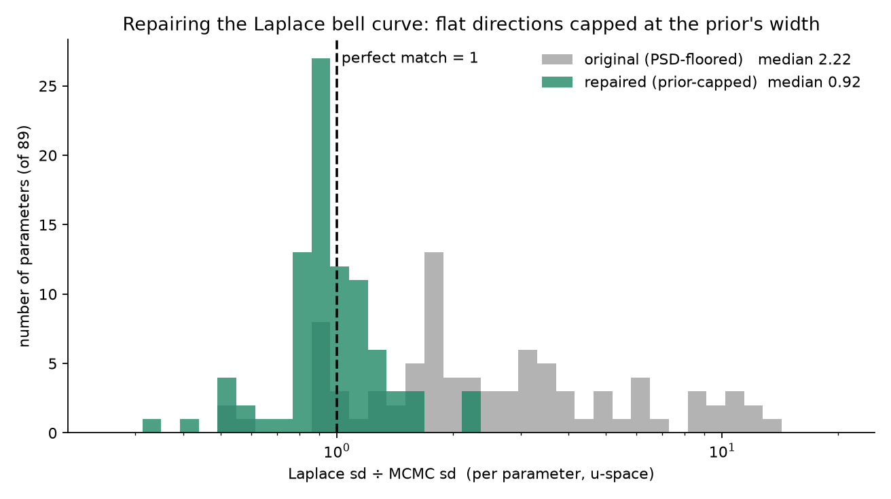
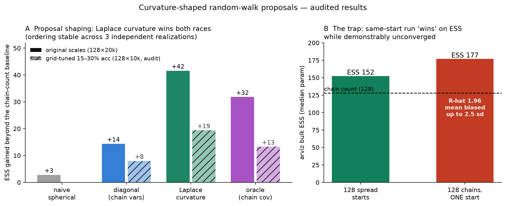
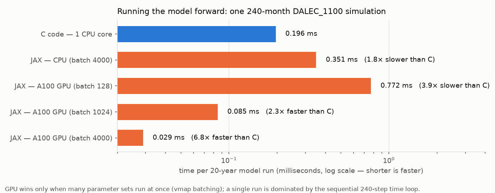
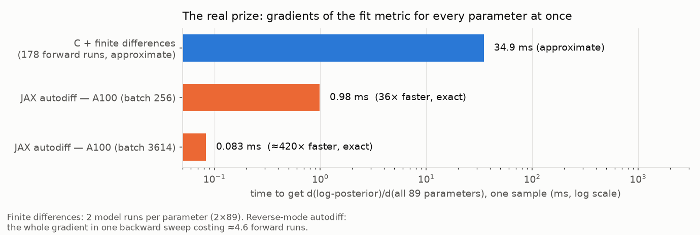

# DALEC_1100 in JAX + a Laplace fast path for the MDF — findings for the CARDAMOM group

*Two developments, one report. **Development 1:** DALEC_1100 rewritten in
JAX and proven numerically identical to the C, with the unmodified C code
itself as referee. **Development 2:** a Laplace-optimizer "fast path" that
uses the port's exact gradients to reach the MCMC's answer quicker and to
provide serviceable error bars in minutes. Every number below is measured;
every surprising claim has been through two rounds of independent
adversarial audit (fresh-seed replications, C-oracle re-scoring, designed
counter-experiments), with all corrections kept on the record. Nothing in
the C was modified.*

*Contact: Sudhanshu Pandey (pandeysu@caltech.edu). Code:
[`PYTHON/dalec_jax`](./) on this branch (`jax-port`) — self-contained:
the demo driver and the 4,000-sample reference posterior are committed,
so goldens, the 30-test suite, and the examples run from a bare clone
plus a C toolchain.*

---

## The key questions, answered up front

**Q1 — Is the JAX DALEC_1100 the same model as the C one?**
Yes, provably: ≤10⁻¹⁰ relative per timestep, per variable, over the full
pipeline (model + 15 EDCs + likelihood), against golden files produced by
the unmodified C; 59/59 paper-style derived quantities (residence times,
allocation, CI envelopes, CH₄ partition…) identical from either engine;
the subset of parameter draws where the model is genuinely chaotic is
certified against the C's own 1-ULP self-divergence. Details in §1.

**Q2 — Does the Laplace optimizer get us to the MCMC solution quicker?**
Yes, in three measured and audited ways (§2): **(a)** its modes are better
than the chain's — 15 of 16 optimizer modes sit at or above the best
sample the production chain ever stored (re-scored through the C engine),
and no chain sample comes within 2.8 log-units of the best mode — giving
an instant MAP plus a per-site convergence alarm the MCMC cannot ring for
itself; **(b)** its modes (or cheap batched rejection) seed the chains,
removing the EDC start-search — the step that never terminated in two
single-chain attempts at this site; **(c)** its covariance, fed to the
random walk as the proposal shape, mixes **2.4–3× better** than
per-parameter tuning — the best shape tested, matching the "oracle"
covariance you could only learn *after* an expensive MCMC.

**Q3 — Is the Laplace approximation good enough for error quantification?**
Good enough for screening and QC; not for publication (§2.2). After a
one-line principled repair — capping likelihood-flat directions at the
prior's width instead of a numerical floor — its per-parameter widths
match the MCMC to a **median ratio 0.92** (was 2.22 before the repair),
typical parameter within ~±35%, and posterior means agree to 0.035 on the
normalized scale. All in minutes of compute. It cannot represent skewness
or boundary-pressed mass, so the MCMC remains the referee for paper
numbers.

**Q4 — Should CARDAMOM switch to gradient samplers (HMC/NUTS)?**
Not as currently formulated (§4): the hard −inf EDC cliffs freeze NUTS
during warmup (step size → 2.5×10⁻¹³), and even on a cliff-free variant it
lost ~6× ESS/s to the existing Metropolis. The random walk is the most
cost-effective sampler per core on this problem — a measured compliment,
not a concession. A soft-EDC (penalty) formulation is the prerequisite for
gradient sampling; untested so far.

**Q5 — Is JAX simply faster than the C?**
No, and we say so plainly (§4). Per core, the `-O2` C is 1.6× faster on
forward runs; per box, two A100s ≈ the entire 256-core node. The port's
value is not forward speed — it's exact derivatives (~1,000× cheaper than
finite differences on one core) and everything in Q2/Q3 that they unlock.

---

## 1. Development 1 — the verified port

- **Code:** [`PYTHON/dalec_jax`](./) (this directory) plus the C-side
  validation harness [`C/projects/JAX_VALIDATION`](../../C/projects/JAX_VALIDATION).
- **Scope:** DALEC_1100 (30 pools, 100 fluxes, 89 parameters; CH₄, snow,
  3-layer soil hydrology + energy), all 15 live EDCs, DALEC_MLF2 with the
  29 observation operators / 31 likelihood terms and all 10 opt_filter
  modes. MCMC itself stays in C.
- **Effort datum:** the port, tests, and equivalence certification were
  completed in one intensive agent session — the methodology transfers to
  other DALEC variants, which share most of their structure.

### The verification standard (the part we'd most like to hand over)

The reference is an **oracle**: `oracle_1100.exe`, compiled from the
*unmodified* model source with production flags, calling `DALEC_1100()`
directly and dumping every intermediate (per-module I/O, full
trajectories, EDC slots, likelihood terms) as golden files. The JAX side
must reproduce them:

| Gate | Coverage | Result |
| --- | --- | --- |
| Leaf physics modules | 16 modules, LHS + edge cases + captured in-situ states | 11/16 **bit-identical**; rest ≤10⁻¹² (erfc/exp chains) |
| Full 240-month trajectories | 120 parameter vectors | 94 pointwise ≤10⁻¹⁰; 26 certified chaotic (see below) |
| EDCs | 60,000 slots over 4,000 posterior samples (JAX EDC operator applied to the C's own trajectories) | **zero mismatches** (booleans, −inf sentinels, short-circuit masks exact) |
| Likelihood terms + total P | 31 terms, sentinel paths | ≤10⁻¹²; sentinels exact |
| End-to-end posterior sweep | 4,000 real MCMC samples | green under a three-clause gate |
| Paper-analysis quantities | 59 derived numbers | 59/59 ≤10⁻¹⁰ from both engines |

One finding worth knowing for *any* DALEC verification effort:
**DALEC_1100 is ULP-chaotic for a subset of parameter draws** — perturbing
the C's own inputs by one unit-in-last-place makes the C diverge from
itself mid-trajectory. For those draws, equivalence is certified against
the C's own 1-ULP self-divergence envelope (the JAX divergence onsets fall
inside it). Chasing pointwise agreement there would be chasing noise.

*Posterior CI envelopes computed independently from C output and JAX
output — overlaid, indistinguishable (differences ≤10⁻¹⁰).*

---

## 2. Development 2 — the Laplace fast path for the MDF

The recipe, all powered by the port's exact derivatives (one backward pass
per gradient vs 178 finite-difference model runs; exact 89×89 Hessians):
run multipoint L-BFGS from ~32 feasible starts (~30 min; 256 starts bought
only +0.36 log-units and found the same basin), keep the modes and
Hessians, then use the one object four ways. Reusable implementation:
[`src/dalec_jax/inference`](src/dalec_jax/inference); runnable demo:
[`examples/laplace_fast_path.py`](examples/laplace_fast_path.py).

### 2.1 Finding the answer: modes better than the chain's

Sixteen independent optimizations reached model log-posterior **−208.2 to
−211.2** — re-scored independently through the C engine by an adversarial
audit. **15 of 16 sit at or above the best sample the production chain
ever stored** (−210.99; the 16th is 0.19 below), all 17–20 log-units above
the chain median (−228.6), and **no stored chain sample comes within 2.8
log-units of the best mode**. Nothing inside an MCMC reveals this — so the
**MAP-minus-chain-best gap is a cheap per-site convergence audit** for
production campaigns. (These are best L-BFGS iterates — the strict
gradient-norm test wasn't met — yet the C itself certifies them above the
chain's reach.)

### 2.2 Good-enough error bars in minutes: the repaired Gaussian

The textbook Laplace step initially overstated the posterior spread ~2.2×
(median; up to ~9× in the tail). The cause was not the posterior but the
bookkeeping: near-flat Hessian directions were floored at 10⁻⁸ curvature,
silently assigning them absurd widths. The principled one-line fix — **a
likelihood-flat direction gets the prior's width** (π²/3 in transformed
coordinates) — repairs it almost entirely:

- spread ratio (Laplace ÷ MCMC, per parameter): median **2.22 → 0.92**,
  p90 **8.92 → 1.35**
- posterior-mean error: median **0.101 → 0.035** (normalized scale)
- bonus: the "winner-take-all" evidence weights were also a floor
  artifact — with honest widths, all 8 modes share weight sensibly.

*Gray: original survey, widths sprawling to 9× too wide. Green: after
capping flat directions at the prior's width — clustered around the
perfect-match line. Cost of the repair: zero extra optimization.*

Use it for: screening sites, spotting which parameters the data constrain
at all, initializing chains, and provisional error bars while the real
chain runs. Do not use it for publication uncertainty — it is a symmetric
bell on a skewed, boundary-pressed posterior.

### 2.3 A quicker MCMC: seeds and a better proposal

**Seeding.** Feasible parameter vectors are measurably rare: the full-gate
iid prior pass rate is ≈6×10⁻⁷ (measured 5.7×10⁻⁷; audit replication with
a fresh seed 7.6×10⁻⁷, every hit confirmed finite through the C engine).
Blind batched rejection therefore finds a start in ~1.3–1.8M evaluations —
**~20 s on one A100** — bounded and trivially parallel. For calibration:
the production ADEMCMC's own pre-search took 7.3% of its 30.7 h run to
deliver 13 starts (~5–8× less sample-efficient than iid rejection, roughly
wall-parity per start), while the single-chain MCMCID-119 search never
terminated at this site in two attempts. So GPU seeding is a bounded
convenience and a rescue for 119-style runs — not a revolution. (Rejection
hits pass the gate but are poor fits, P ≤ −3.8×10⁴; seeded chains still
need burn-in. Laplace modes are far better seeds.)

**Proposal shape.** Feeding the repaired Laplace covariance to the random
walk as its proposal shape was raced against a naive spherical proposal, a
per-parameter diagonal (≈ what adaptive tuning achieves), and the "oracle"
full chain covariance — then adversarially audited with a grid-tuned
re-race and a designed control:

*A: mixing gained beyond the chain-count baseline at original scales
(solid) and in the audit's properly-tuned re-race (hatched) — the Laplace
shape wins both, so the advantage is not a tuning artifact. B: the audit's
decisive control — a deliberately unconverged run (all chains from one
start; R-hat 1.96, biased mean) scores HIGHER multi-chain ESS than the
legitimate run.*

- **Survived the audit:** the Laplace shape mixes best per median
  parameter — increment **2.4× the diagonal's when all shapes are
  grid-tuned** to 15–30% acceptance (+19.4 vs +8.0 per 128 chains × 10k
  iters), 2.9× at original scales; ordering stable across three
  independent realizations; tolerates the largest steps; ≈ matches the
  oracle covariance on median mixing (the oracle keeps the better
  *worst*-parameter mixing).
- **The sobering context:** no proposal shape rescues the random walk
  here — no run came near convergence (split-R-hat 2.6–4.2); even the
  best shape needs ≈2×10⁴ iterations per effective sample (median
  parameter; ~10⁵ for the slowest). Shaping buys ~3×; the geometry costs
  tens of thousands.
- **A methodological caution worth stealing:** multi-chain bulk ESS from
  short runs is a *diversity meter, not a convergence certificate* — the
  audit's same-start control scored ESS 177 (vs 152 for the legitimate
  run) while demonstrably biased. Any short-many-chains ESS should face a
  same-start control before being believed.

### 2.4 What does NOT work (measured, so nobody repeats it)

- **Importance reweighting on top of the Laplace mixture:** collapses in
  89 dimensions — only 2.3% of Gaussian draws survive the EDC cliffs and
  one draw carries all the weight (ESS = 1 of 65,536; PSIS tail
  unfittable). An annealed/SMC bridge would be needed.
- **NUTS on the hard-EDC target:** frozen in warmup (§4).
- **More optimizer starts:** 32 → 256 bought +0.36 log-units, the same
  basin, and identical Gaussian errors.

### The combined picture

Use the Laplace object three ways at once — **modes to seed the chains,
covariance to shape the proposal, repaired Gaussian as the instant
provisional answer** — and let the production random walk deliver the
publication distribution, now started right, stepping ~3× smarter, and
cross-checkable against the provisional answer. Laplace does not replace
the MCMC; it makes every part of the MCMC's job easier and auditable.

---

## 3. Other findings about the C code (no JAX required)

### 3.1 `CARDAMOM_RUN_MODEL` stale-trajectory hazard

`DALEC_MLF2.c:47` skips the model call when a sample fails the prerun
EDCs — but `CARDAMOM_RUN_MODEL.c:424–425` writes the output buffers
unconditionally, so they still hold the *previous* sample's trajectory.
Forward-run files produced through this path can contain trajectories that
belong to the wrong parameter vector. Our validation had to bypass it (the
oracle calls `DALEC_1100()` directly with per-sample zeroed buffers).
Recommend zeroing/flagging skipped samples or documenting the behavior
prominently.

### 3.2 Defect catalog from line-by-line transcription

Each is reproduced **exactly** in the JAX port (policy: bug-compatible,
never silently fixed), so the two engines stay interchangeable while you
decide which are intentional. All were line-verified by an independent
audit; full details in [`BUG_COMPAT.md`](BUG_COMPAT.md).

| Item | Where | Effect |
| --- | --- | --- |
| Layer-2 overflow excess added to the layer-1 drainage flux (`q_ly1 +=`) | DALEC_1100.c:784 | water above LY2's maximum is dumped into the LY1 drainage term |
| Float equality `(D_LF_LY1+D_LF_LY2)==2` | DALEC_1100.c:506 | branch depends on exact representability |
| π = 3.1415927 (7 digits) | GLOBAL constants | ~10⁻⁸ relative bias in trig-derived quantities |
| Non-finite freeze semantics | timestep loop | breaking step's non-finite values are recorded; later steps stay zero |
| EDC dispatcher short-circuit | EDC loop | later EDC slots hold stale values after an early failure |
| Obs-operator integer-division index | CH₄:CO₂ operator | a flux-index ratio computed by int division is used as a *parameter* index |
| `c3frac` never set in one path | obs prep | silently reads `pars[0]` |
| `9999` uncertainty placeholder | obs loading | read but unused |

Also: the **pre-existing partial JAX sketch in the repo**
(`PYTHON/.../DALEC_1100_JAX_MLF.py`) misdefines the disturbance flux
indices (`dist_lab`=7, `dist_roo`=11, where the C truth is 89–92 and slots
7/11 belong to `ph_fol2lit`/`lab2lit`) and then never writes those fluxes
at all; it also uses non-C drainage, non-C 10⁻⁴ clamps, and has no EDCs —
it predates this work and should carry a deprecation note.

---

## 4. The benchmarks in full

All numbers measured on 2× AMD EPYC 7H12 (256 cores) + 2× A100-40GB; C
compiled `-O2` for performance rows; JAX float64 with strict-equivalence
compile flags; same workload everywhere (full pipeline, 4,000-sample
posterior).

*Forward throughput. Per core the C wins (0.437 vs 0.692 ms/sample). Per
box it's a tie: two A100s (0.0063 ms/sample) ≈ the entire 256-core node
(0.0068).*

**Nobody should port to JAX for forward throughput alone.** The port pays
for itself elsewhere:

*Gradients of the log-posterior w.r.t. all 89 parameters: C central finite
differences 83.5 ms (178 model runs, approximate) vs JAX reverse-mode
0.083 ms at batch (exact) — ~1,000× one core, ~16× the whole node. Where
both are finite they agree to a median of ~10⁻¹⁴ of the per-sample
gradient scale (per-component agreement is limited to ~10⁻⁸ by the FD's
own roundoff floor) — the C's numerics certify the autodiff down to the FD
noise floor. After value-identical NaN-hardening, gradients are finite for
3,613/3,614 genuine posterior samples.*

### The sampler race (one site, 240 months, hard EDCs)

*Left: gradient optimization reaches modes at or above anything the chain
stored (15 of 16, C-verified). Middle: but per core, Metropolis wins
ESS/s. Right: the Laplace width errors before and after the flat-direction
repair.*

- **C MHMCMC:** 0.700 ms per full-pipeline evaluation with EDCs (⇒ 1,429
  evals/s per core); the most cost-effective sampler per core in this
  study. (Caveat: ESS-based ratios rest on short stored chains — read them
  as order-of-magnitude.)
- **NUTS (blackjax, A100): structural failure on the real target.** The
  posterior concentrates against the hard −inf EDC cliffs; step-size
  adaptation collapsed to 2.5×10⁻¹³. On a cliff-free variant it ran
  healthily but still lost ~6× ESS/s to Metropolis (a NUTS draw costs
  ~2,800 proposals' worth of model time here). **"Just switch to HMC" does
  not work on the hard-EDC formulation**; soft EDCs are the prerequisite.
- **Multipoint Laplace:** see §2 — the fast path.

### Maintainability

Identical verified behavior in **1,888 hand-written JAX lines vs 5,725 C
lines** (~3×), plus ~2,016 lines of oracle/test infrastructure — a
deliberate ~1:1 proof-to-model ratio that any future DALEC port can reuse.

---

## 5. A proposed joint next step

**A one-to-two-day, 204-site FluxVal campaign using both engines** (the
drivers ship in `DATA/CARDAMOM-FLUXVAL_v1.0/`):

1. Batched GPU rejection + Laplace optimization finds starts and modes for
   every site (bounded, trivially parallel; rescues any site where a
   119-style search would stall);
2. the C chains sample all 204 posteriors on the node — config-dependent:
   a single 500k-iteration chain per site is ~6 min/core, the production
   400-chain ADEMCMC config ~28 core-hours/site (~1 node-day for all
   204) — now seeded and proposal-shaped by step 1;
3. the repaired-Laplace pass provides per-site provisional uncertainty and
   the MAP-gap convergence audit (~2 h).

The same certified-equivalent pair also opens: parameter sensitivity and
observing-system design via exact derivatives, soft-EDC samplers, hybrid
ML-physics DALEC variants, and emulator training — none reachable from the
C at any core count.

---

## 6. Getting it / reproducing

See the [README](README.md) for quick start, environment gotchas, and the
docs map ([`BUG_COMPAT.md`](BUG_COMPAT.md),
[`tests/TOLERANCES.md`](tests/TOLERANCES.md), [`CHANGELOG.md`](CHANGELOG.md)).
We're glad to open the upstream PR, port another DALEC variant the same
way, or run the 204-site pilot — whichever is most useful to the group.

---

*Caveats, on the record: all sampler, search, and Laplace findings are
from one site/CBF (the bundled 1100 demo driver) at monthly resolution;
likelihood filter modes 1, 2, 4–9 are implemented but not yet
golden-covered; the only true transcendental divergence vs glibc is erfc
(≤34 ULP, ~4×10⁻¹⁵ relative). Every surprising claim went through two
independent adversarial audit rounds (fresh-seed replications, C-oracle
re-scoring of modes and feasibility hits, source/log verification,
designed counter-experiments). Four statements did not survive in their
original form and are corrected in place above: the start-search cost
accounting (§2.3), "all 16" modes (§2.1 — it's 15 of 16), the
finite-difference agreement wording (§4), and an ESS interpretation in the
proposal test (§2.3).*
