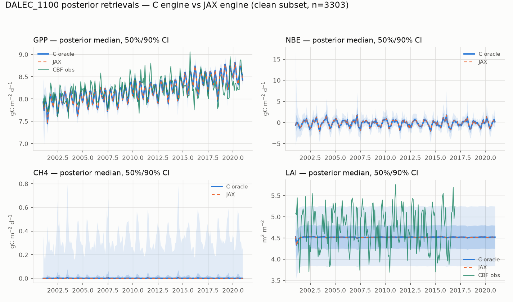
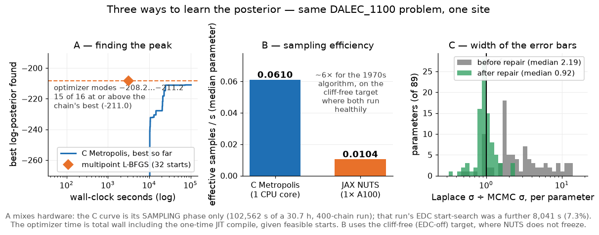
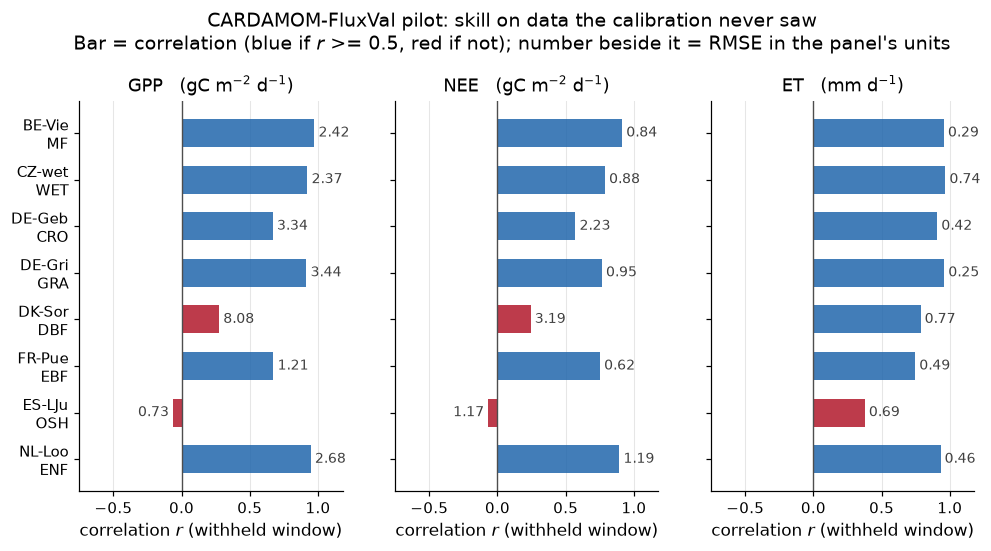

# CARDAMOM × JAX

### Same model. Exact gradients. New ways to interrogate inference.

**A verified differentiable companion to CARDAMOM—not a replacement for the C model.**

[Full findings](../FINDINGS.md) · [Code and quick start](../README.md) · [JAX branch](https://github.com/sudshu/CARDAMOM/tree/jax-port/PYTHON/dalec_jax)

---

## The result at a glance

| **Verified** | **Differentiable** | **Useful now** | **Honest limitation** |
| :---: | :---: | :---: | :---: |
| ≤10⁻¹⁰ agreement | all 89 sensitivities together | modes, curvature, batching | C is faster per core forward |
| 60,000 EDC operator slots: **0 mismatches** | gradient: **0.083 ms/sample** at batch | 15/16 modes ≥ chain best | hard EDCs defeat NUTS |
| 59/59 analyses reproduced | ≈**1,000×** one-core finite differences | 6/8 FluxVal sites generalize | MCMC remains the referee |

EDC figure is operator-level: the JAX EDC operator applied to the C's own trajectories. End-to-end, 1,683 of 60,000 differ, every one inside the C's certified ULP-chaos envelope.

> **The one-line story:** JAX does not make every model call faster. It makes gradients, curvature, batched experiments, and inference diagnostics practical while retaining the C model as the numerical authority.

---

## 1 — First, prove it is the same model

The C and JAX posterior summaries were calculated independently. Their overlap is the point.

- Complete port: **30 pools · 100 fluxes · 89 parameters · 15 EDCs · 31 likelihood terms**
- Stable trajectories agree to **≤10⁻¹⁰ per timestep and variable**
- ULP-sensitive trajectories are tested against the C model's own perturbation envelope

**Agentic-coding lesson:** the new model contains 1,888 hand-written JAX lines—and about 2,016 additional lines devoted to the oracle and tests. Generating code was the short part; proving equivalence was the project.

---

## 2 — The speed result is about gradients

| Question | Answer |
| --- | ---: |
| One forward evaluation per CPU core | **C wins by 1.6×** |
| Large-batch forward throughput | **2× A100 ≈ 256 CPU cores** |
| Gradient of all 89 parameters | **83.5 ms C finite differences → 0.083 ms JAX** |

### ≈1,000× faster for the audited, batched all-parameter gradient

That is **not** a claim that the forward model is 1,000× faster. It is one core against one core, on the full workload — model, EDCs and likelihood. Per box, two A100s roughly match the whole 256-core node.

---

## 3 — Gradients change the inference workflow

| A — Find the peak | B — Respect the geometry | C — Get a rapid first uncertainty |
| --- | --- | --- |
| **15/16** optimizer modes reached or exceeded the best stored chain sample | NUTS freezes on hard `−inf` EDC cliffs; C Metropolis remains more efficient | repaired Laplace/MCMC width ratio: **≈2.2 → 0.92** |

**Practical workflow:** use JAX to find and verify modes, initialize chains, shape proposals, and flag convergence gaps. Use C MCMC for the publication posterior.

---

## 4 — Then test somewhere the model has not seen

### Six of eight sites reproduce withheld GPP and ET seasonality

- GPP correlation: **0.67–0.97** at the six successful sites
- ET correlation: **0.75–0.97**
- Every JAX MAP was re-scored by C to within **1.1×10⁻¹²** in log-posterior

*Driver caveat: three met fields DALEC_1100 needs are absent from the
1005-era FluxVal files and are filled here with documented proxies — the
longwave one measures 8.8–13.8% low against ERA5. Real ERA5-Land drivers are
in hand and the re-run is under way, so these numbers will move.*

The multi-site pilot also found what the demonstration site hid: only **39/64** modes had usable curvature, zero snowfall can invalidate every parameter vector, and near-zero LAI needs an explicit log-space threshold.

> **Interpretation:** the encouraging result is the withheld skill. The more valuable result may be the failure modes that became visible only after leaving the demonstration site.

---

## The proposal to the CARDAMOM group

1. Keep the **C implementation and MCMC as the reference**.
2. Use JAX for **optimization, sensitivities, curvature, batching, and convergence checks**.
3. Select one jointly owned CBF/CBR benchmark and agree on the validation gate.
4. Decide the next priority: **ERA5-backed FluxVal**, multi-site batching, or a carefully validated soft-EDC experiment.

### The question is no longer “Can CARDAMOM run in JAX?”

### It is “Which new CARDAMOM questions should exact gradients answer first?”

