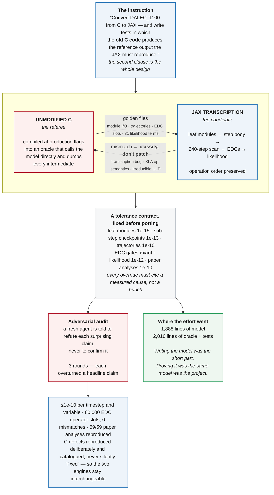
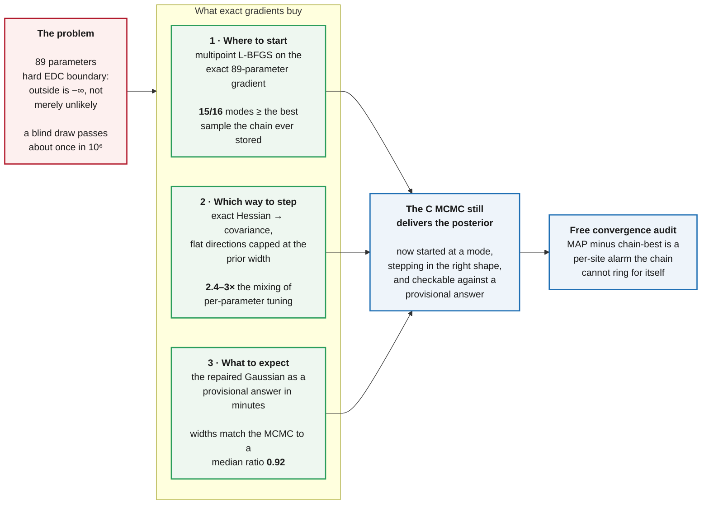

# Two diagrams: how it was built, and what the fast path does

Both render natively on GitHub — edit the text, not an image.

---

## 1 — How the port was built

The question about an LLM-written port is not "does it run" but "why would I
trust it". The answer is the shape of the process: the unmodified C is never
the thing being replaced during development. It is the referee, at every
level, against tolerances fixed before any porting started.

**Note on sources.** The model was transcribed from the **C source**, not from
papers — papers cannot specify operation order, a 7-digit π, or which defects
to preserve. The methodology follows arXiv:2606.07681; Bloom & Williams (2015),
Norton et al. (2023) and Yang et al. (2022) informed the EDCs, the model
lineage and the FluxVal protocol respectively.

---

## 2 — What "Laplace-guided MCMC" means

The optimizer does **not** replace the chain. It supplies three things the
chain would otherwise have to discover for itself, expensively.

### The honest limits

| | |
| --- | --- |
| The Gaussian is a **screening** answer | a symmetric bell cannot represent this posterior's skew; the MCMC stays the referee for published numbers |
| The optimizer can land **on the boundary** | only **39 of 64** modes across 8 sites had a finite, positive-definite Hessian — where the best mode is not among them, the covariance is unusable |
| That used to fail **silently** | a NaN covariance gives NaN proposals, every Metropolis ratio compares false, and the chains sit frozen at 0% acceptance looking like a merely hard target. Both failure modes now raise. |
| Gradient samplers do **not** rescue this | NUTS freezes on the hard EDC cliffs (step size → 2.5e-13); a soft-EDC formulation is the untested prerequisite |
